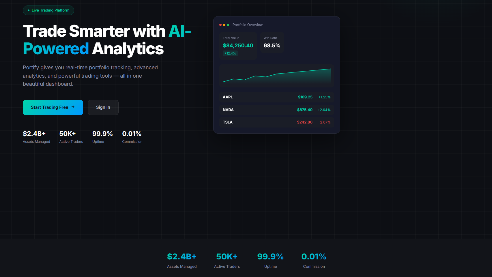
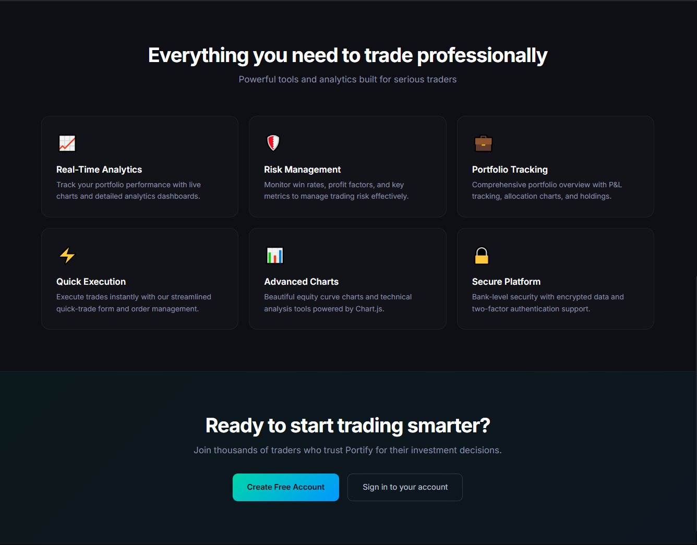
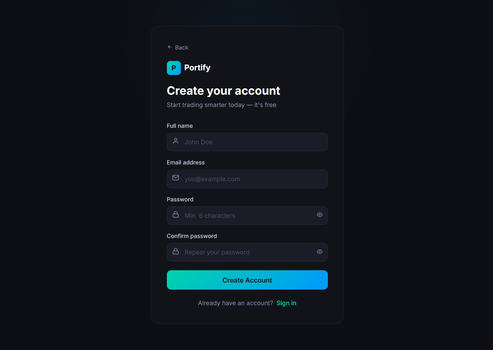
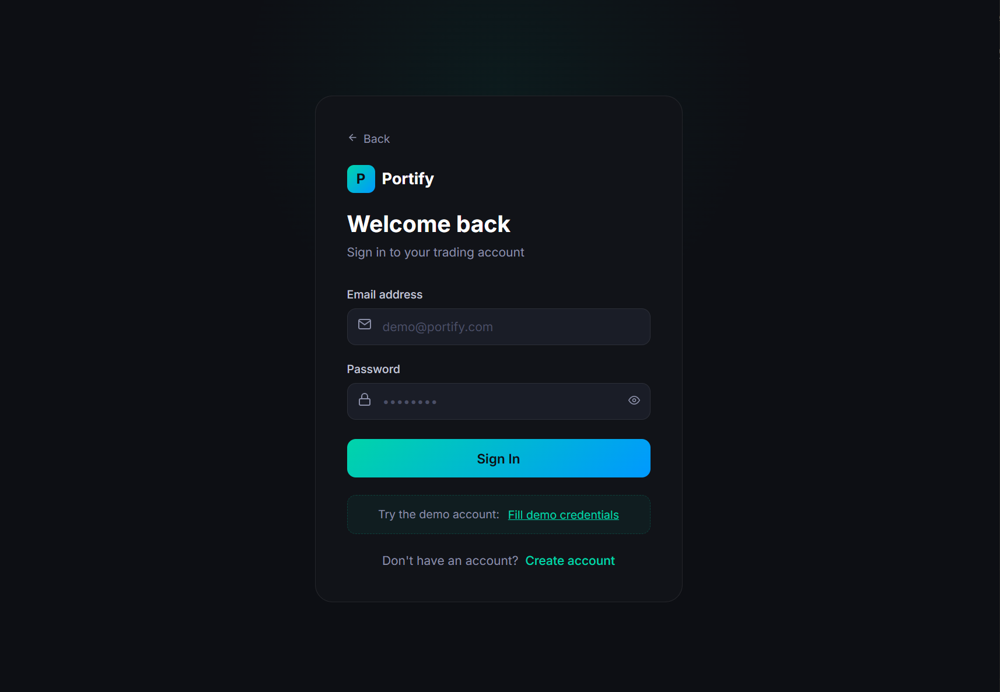
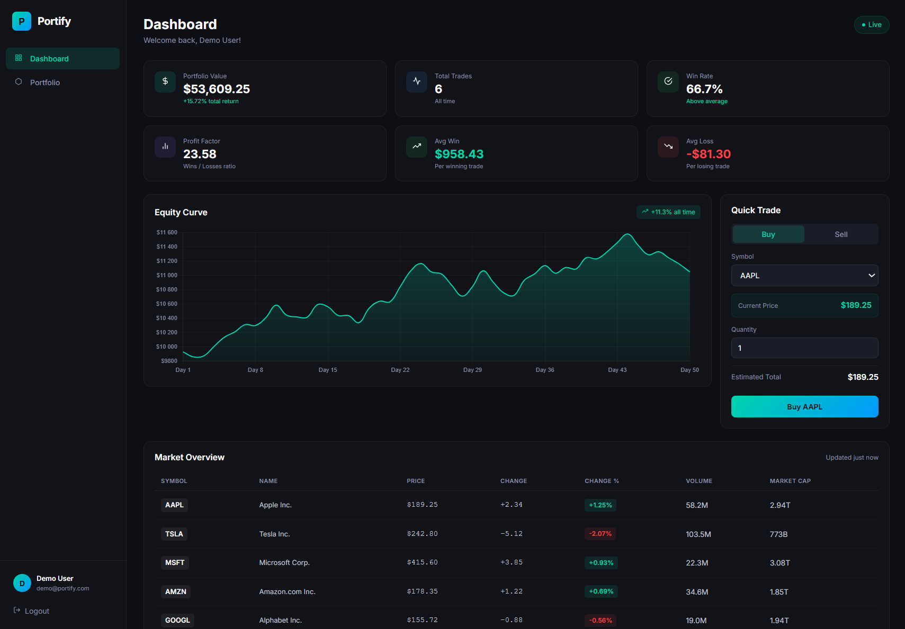
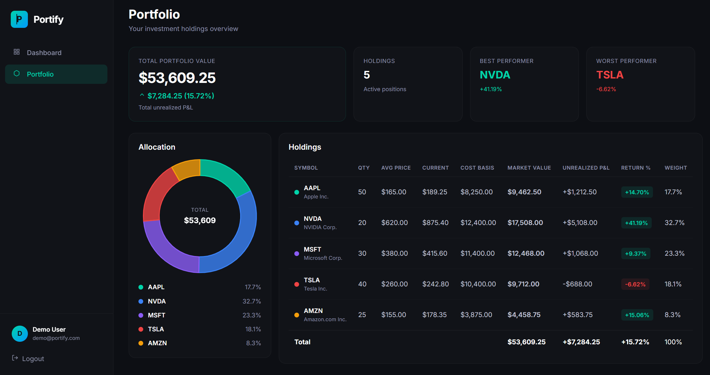

# 📈 Portify — Investment Portfolio Dashboard

> **A full-featured trading dashboard built with modern Angular 21 architecture.**
> Clean dark UI, reactive state with Signals, interactive Chart.js visualizations, and a complete auth flow — all without NgRx or Zone.js.

  

---

## Screenshots

### Landing Page




### Sign up page



### Login page



### Dashboard



### Portfolio



---

## Live Demo

**[View live demo](https://jakubnovak998.github.io/Portify/)**

> **Demo credentials**
>
> - `demo@portify.com` / `demo123`
> - `trader@portify.com` / `trade123`

---

## Features

### Dashboard

- Real-time portfolio stats (total equity, win rate, profit factor, avg win/loss)
- Interactive equity curve chart with all-time performance badge
- Market overview table with live-style stock prices
- Quick trade form with live estimated total calculation

### Portfolio

- Donut allocation chart (Chart.js, raw Canvas API)
- Holdings table with cost basis, market value, unrealized P&L, return %, weight
- Best/worst performer tracking
- Portfolio summary with total return

### Authentication

- Login & register with reactive form validation
- Route guard protecting dashboard and portfolio pages
- Mock user store with lazy-loaded JSON, cached via `shareReplay`

---

## Tech Stack

| Layer            | Choice                                             |
| ---------------- | -------------------------------------------------- |
| Framework        | Angular 21, standalone components                  |
| Change detection | Zoneless (`provideZonelessChangeDetection`)        |
| State            | Angular Signals — no NgRx, no Subject boilerplate  |
| Charts           | Chart.js 4 (direct Canvas API, no wrapper library) |
| Styling          | SCSS, custom dark design system                    |
| Testing          | Vitest                                             |
| HTTP             | Angular `HttpClient` with RxJS pipelines           |

---

## Architecture Highlights

- **Zoneless Angular** — latest change detection model for better performance and predictability
- **Signal-based services** — `MarketService` exposes computed signals (`holdingsWithPnl`, `bestPerformer`, `dashboardStats`) consumed directly in templates
- **Business logic in services** — components are thin; all calculations (P&L, allocation, equity curve percent) live in `MarketService`
- **Lazy HTTP with `shareReplay`** — auth JSON loaded on first login, cached for the session
- **Typed models** — strict interfaces for `Stock`, `PortfolioItem`, `Trade`, `HoldingWithPnl`, `DashboardStats`

---

## Getting Started

```bash
npm install
npm start
```

Open [http://localhost:4200](http://localhost:4200) and log in with the demo credentials above.

---

## Project Structure

```
src/app/
├── core/
│   ├── models/          # TypeScript interfaces
│   ├── services/        # AuthService, MarketService
│   └── guards/          # Auth route guard
├── features/
│   ├── auth/            # Login, Register
│   ├── dashboard/       # Stats, equity chart, market table, quick trade
│   ├── home/            # Landing page
│   └── portfolio/       # Holdings table, allocation chart, summary
└── shared/
    ├── components/      # Navbar, sidebar, SVG icon loader
    └── pipes/           # FormatVolume pipe
```

---

_Built by jakubnovak998._
